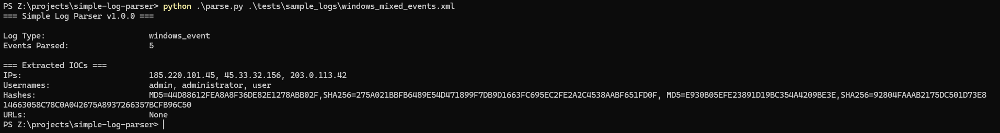
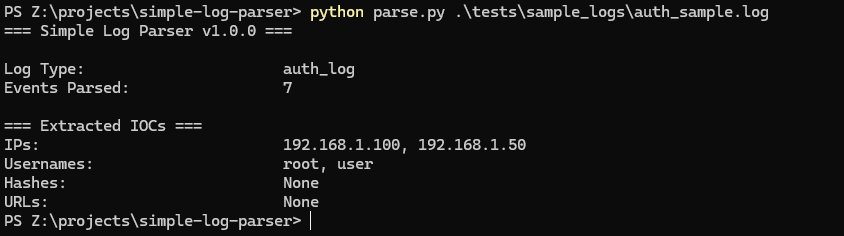
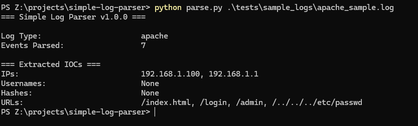
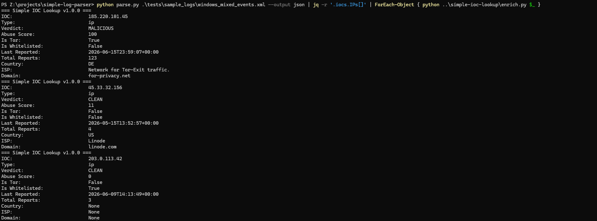

# Simple Log Parser

A Python-based log parsing tool that automatically detects and parses Windows Event XML, Apache access logs, and Linux auth.log files, extracting IOCs for triage.

## Usage
Windows:
```
python parse.py <logfile>
```
Linux/Mac:
```
python3 parse.py <logfile>
```

JSON output:
```
python parse.py <logfile> --output json
```

Pipe extracted IPs into Simple IOC Lookup:
```
python parse.py <logfile> --output json | jq -r '.iocs.IPs[]' | ForEach-Object { python ..\simple-ioc-lookup\enrich.py $_ }
```

Tested using Python 3.10.11

## Requirements
```
pip install -r requirements.txt
```

## Supported Log Types

| Log Type | Format | IOCs Extracted |
|----------|--------|----------------|
| Windows Event XML | Exported from Event Viewer or wevtutil | IPs, Usernames, Hashes |
| Linux auth.log | Syslog format | IPs, Usernames |
| Apache Access Log | Combined Log Format | IPs, URLs |

## Features
- Automatic log type detection
- IOC extraction using pandas
- JSON output mode for piping into other tools
- Compatible with [Simple IOC Lookup](https://github.com/philipzangara/simple-ioc-lookup) for full triage pipeline

## How It Works

1. Reads the first 200 characters of the log file to detect format
2. Routes to the appropriate parser based on log type
3. Extracts IOCs from parsed events
4. Outputs results to terminal or JSON

## Windows Event XML Export

Export logs from Event Viewer or PowerShell:
```
wevtutil epl Security output.xml /ow:true
```

Note: `.evtx` binary files are not supported — export as XML first.

## Sample Output

**Windows Event Log**


**auth.log**



**Apache Access Log**



**Pipe to Simple IOC Lookup**



## Sample Data
Test logs included in `tests/sample_logs/`.

## Code Quality
- Type checked with mypy
- Unit tested with unittest

## Author: Philip Zangara

## License: MIT

Disclaimer: Built independently, with AI used as a learning aid for guidance and debugging feedback.